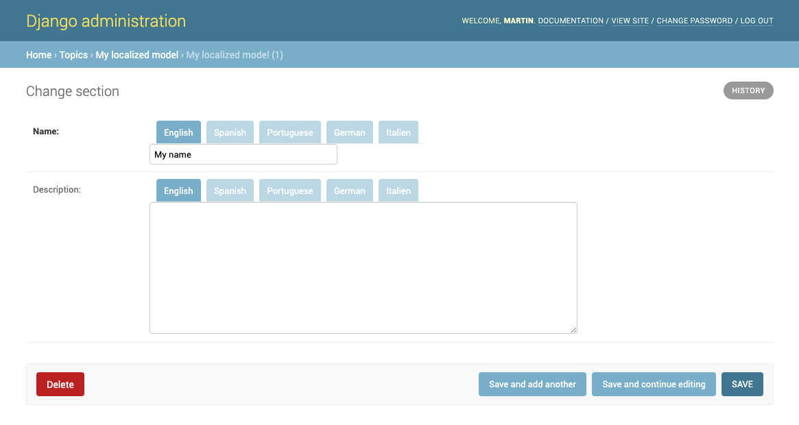

Django Admin
------------

To display ``LocalizedFields`` as a tab bar in Django Admin; inherit your admin model class from ``LocalizedFieldsAdminMixin``:

.. code-block:: python

    from django.contrib import admin
    from myapp.models import MyLocalizedModel

    from localized_fields.admin import LocalizedFieldsAdminMixin

    class MyLocalizedModelAdmin(LocalizedFieldsAdminMixin, admin.ModelAdmin):
        """Any admin options you need go here"""

    admin.site.register(MyLocalizedModel, MyLocalizedModelAdmin)

